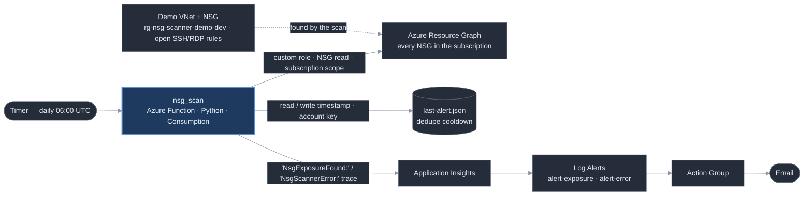

# Network Security Posture Scanner

> Scans a subscription's network security groups for common exposure mistakes — open RDP/SSH, overly broad inbound rules — and reports what's at risk.


## The problem

An inbound rule that allows the whole internet to reach port 22 or 3389 is how
most cloud VMs get compromised. It usually starts as a convenience — someone
opens SSH or RDP "just to get in and fix something" and never closes it — and
then it sits there. Nothing in Azure objects. The rule looks the same in the
portal as any other, and unless someone is specifically checking every network
security group by hand, an internet-facing management port can stay open for
months.

This checks every NSG in the subscription once a day and emails you in plain
English when one of them exposes a sensitive port to the internet.

## What it does

- Runs on a timer, once a day (06:00 UTC).
- Issues one Azure Resource Graph query for every network security group in the
  subscription — no per-resource SDK calls, no resource-group allowlist.
- Flags a custom inbound rule when it is `Allow` + `Inbound` + TCP or any
  protocol + an internet-facing source (`*`, `0.0.0.0/0`, `Internet`, `::/0`) +
  a sensitive destination port. Default sensitive ports: 22, 3389, 1433, 3306,
  5432 (SSH, RDP, SQL Server, MySQL, PostgreSQL). A broad port range that spans
  one of them counts.
- On any match, logs an `NsgExposureFound:` line naming the NSG, the rule, the
  port, and the source; a Log Alert turns that into an email.
- Alerts once, then stays quiet for a cooldown window while the exposure is
  still there, instead of emailing every day.
- A separate, higher-severity alert fires on `NsgScannerError:` — raised on an
  unexpected failure — so a broken scanner doesn't just go silent.
- Stores nothing about past scans. The only persisted state is a single
  timestamp blob for the cooldown.

## Architecture



[docs/architecture.md](docs/architecture.md) has the same diagram plus a short
walkthrough of the design, the auth model, and the alerting path.

**Services used:** Functions, Bicep + `azd`, Azure Resource Graph, Storage,
Log Analytics, Application Insights, Azure Monitor, Action Groups.
**Auth:** system-assigned Managed Identity holding exactly one role — a custom
role whose only action is `Microsoft.Network/networkSecurityGroups/read`,
assigned at subscription scope because the scan is subscription-wide. The
cooldown blob is reached with an account-key connection string already in the
app settings, so no data-plane role is added. No stored secrets, no client
credentials in code or config.

## Environment

Runs against a live Azure subscription I co-administer — not a disposable
sandbox. The one NSG it finds is a deliberately misconfigured demo target
(`rg-nsg-scanner-demo-dev`, a VNet and an NSG with open SSH and RDP rules) that
ships in the same `azd up`, but the subscription, the Resource Graph query, the
custom RBAC role, and the alerting are all real. The scan is not limited to that
resource group — it evaluates every NSG in the subscription, which is the point.

## What this doesn't do

- **No auto-remediation.** It detects and alerts; it does not close or narrow
  the rule. Changing live network rules automatically is a separate, higher-risk
  capability and out of scope.
- **NSGs only.** Azure Firewall, Front Door / Application Gateway WAF, and
  Application Security Groups are other network controls this does not look at.
- **Binary result.** A rule either meets the exposed-sensitive-port criteria or
  it does not. No CIDR-breadth weighting, no port-count weighting, no risk score.
- **No rule-precedence modelling.** An `Allow` rule that is actually shadowed by
  a higher-priority `Deny` is still reported. Known limitation.
- **One global cooldown**, not per-NSG or per-finding.
- **No OIDC deploy pipeline.** `azd up` is a workstation operation. A
  deploy-capable identity federated to a public repo is not justified for a tool
  one person deploys by hand. Deferred, same as the sibling projects.

## Running it yourself

```bash
azd env new nsg-scanner-dev
azd env set AZURE_LOCATION eastus2
azd env set NOTIFICATION_EMAIL you@example.com
azd up
```

One `azd up` creates two resource groups: the scanner (`rg-nsg-scanner-dev`) and
the deliberately-flawed demo target (`rg-nsg-scanner-demo-dev`). `azd down`
removes both.

The deploy defines a custom role and assigns it at subscription scope, so the
account running it needs `Owner` or `User Access Administrator` on the
subscription — more than the `Contributor` a plain resource deploy needs.
`SENSITIVE_PORTS` (default `22,3389,1433,3306,5432`) and `ALERT_COOLDOWN_DAYS`
(default `3`) are overridable app settings.

## Sample output

The demo NSG has three internet-facing inbound rules: SSH (22) and RDP (3389),
which are real misconfigurations, and HTTPS (443), which is benign. A scan:

```
NsgExposureFound: 2 exposed rule/port combination(s) across 1 NSG(s) - nsg-nsg-scanner-demo-dev/allow-rdp-from-internet exposes port 3389 to Internet; nsg-nsg-scanner-demo-dev/allow-ssh-from-internet exposes port 22 to Internet
```

Port 443 does not appear — the scanner flags the exposed management ports and
leaves the legitimate web rule alone. That `NsgExposureFound:` line is what the
Log Alert matches, and within about ten minutes it arrives as an email:

```
Fired: Sev3  NSG Scanner - internet-exposed sensitive port
       on appi-nsg-scanner-dev (microsoft.insights/components)

Alert name         NSG Scanner - internet-exposed sensitive port
Severity           Sev3
Monitor condition  Fired
Affected resource  appi-nsg-scanner-dev   (rg-nsg-scanner-dev)
Description        Fires when the Function logs an NsgExposureFound trace to Application Insights.
Signal type        Log   (Log Alerts V2)
Search query       traces | where message startswith "NsgExposureFound:"
Time aggregation    Count     Operator  GreaterThan     Threshold  0
Metric value        1         Number of violations  1
```

The email carries the rule and the match count; the finding detail — which NSG,
which rule, which port — is one click away under "View query results". Azure
Monitor log alerts notify on the query result count, not the row contents.

Trigger the scan again while the rules are still open:

```
NsgScanner: 2 exposed rule/port combination(s) still present but suppressed - last alert was within the 3-day cooldown.
```

No second email. With no exposed rules in the subscription the run ends:

```
NsgScanner: 1 NSG(s) evaluated, 0 exposed rules found.
```

## Cost

Built entirely on Azure's free-tier grants (Functions Consumption: 1M
executions/month free; Log Analytics ingestion capped and the first 5 GB/month
free). The only resources that bill at all are the two Azure Monitor log-alert
rules, at a few cents a month combined. Estimated cost if left running and
forgotten for a year: **under $0.50 total.** There is no Budget resource here —
the sibling Cost Sentinel project owns the subscription-wide budget guardrail.

## Built with

Designed and reviewed with Claude (architecture, spec-tightening, README),
implemented with Claude Code / Azure CLI in VS Code.

---

## Portfolio series

A five-project Azure/M365 portfolio, built in order:

1. [azure-cost-sentinel](https://github.com/realitylvn/azure-cost-sentinel) — flags anomalous subscription spend in plain English
2. [m365-offboarding-automator](https://github.com/realitylvn/m365-offboarding-automator) — runs the Microsoft 365 leaver checklist via the Graph API
3. [azure-drift-detector](https://github.com/realitylvn/azure-drift-detector) — alerts when live resource config drifts from a reference
4. [azure-nsg-scanner](https://github.com/realitylvn/azure-nsg-scanner) — finds NSG rules open to the internet, subscription-wide *(you are here)*
5. [azure-ops-command-center](https://github.com/realitylvn/azure-ops-command-center) — one live status view over all four
