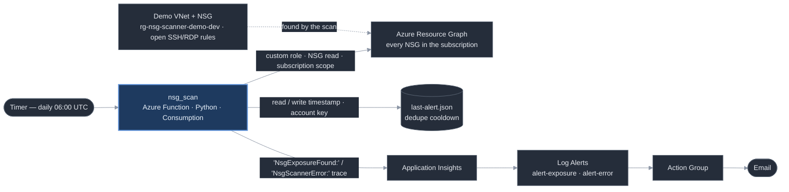

# Architecture

**Services used:** Bicep + `azd`, Azure Functions (Consumption / Y1), Azure
Resource Graph, Storage (dedupe blob), Log Analytics, Application Insights, Azure
Monitor scheduled query rules, Action Groups. GitHub Actions for template + test
validation.

The scanner stores nothing about past scans. Every run issues one KQL query
against Azure Resource Graph for the current state of every network security
group in the subscription, evaluates each custom inbound rule against a fixed set
of risk criteria (Allow + Inbound + TCP/any + internet-facing source + a
sensitive destination port), and on any match logs a plain-English
`NsgExposureFound:` trace. The only persisted state is a single timestamp blob
that suppresses repeat alerts while an exposure is ongoing.

**Auth:** the Function's system-assigned managed identity holds exactly one role
— a custom role with the single action `Microsoft.Network/networkSecurityGroups/read`,
assigned at subscription scope because the scan is subscription-wide by design.
The dedupe blob is reached with an account-key connection string (an app setting,
encrypted at rest), so no data-plane role is added. No stored secrets, no client
credentials.

**On a finding:** the Function logs `NsgExposureFound:` to Application Insights;
a `scheduledQueryRules` Log Alert matches that trace and fires an Action Group
email. A separate higher-severity rule watches for `NsgScannerError:` — raised on
an unexpected failure — so the scanner cannot silently go dark.
